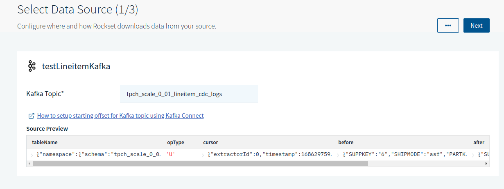

# Destination Rockset
Rockset can use Arcion's Change Data Capture (CDC) formats to ingest data from sources like Amazon S3 and Kafka. Arcion-Rockset integration allows you to leverage Arcion's fast CDC capabilities to effectively bring CDC data from source into Rockset.

## Overview
Arcion uses [efficient CDC formats]() to replicate data from any database to S3 and Kafka. To simplify bringing CDC data into Rockset, Rockset has added support for [Arcion CDC formats through CDC templates](https://rockset.com/docs/cdc/#arcion). This allows you to quickly move CDC data into Rockset's managed data sources S3 and Kafka.

## Set up Amazon S3
Follow these steps to set up S3 as data source in Rockset that uses Arcion CDC format to ingest data:

1. Integrate S3 with Rockset by following the steps in [Create an S3 Integration](https://rockset.com/docs/amazon-s3/#create-an-s3-integration).
2. [Create a collection](https://rockset.com/docs/amazon-s3/#create-a-collection) from S3 source. This involves specifying the S3 path from which Rockset ingests data. Once you specify a path, Rockset shows you a preview of the data in that path.
3. Select **Arcion** from the **Template** dropdown in the **Ingest SQL Editor** widget. 
4. Create a custom SQL to ingest data from [Arcion’s S3 format]().
The following sample ingests a table with the primary key `CUSTKEY`:

    ```SQL
    SELECT
      -- Rockset special fields (https://rockset.com/docs/special-fields)
      IF(opType = 'D', 'DELETE', 'UPSERT') AS _op,
      IF(opType = 'D',
          ID_HASH(_input.before.CUSTKEY),
          ID_HASH(_input.after.CUSTKEY)
      ) AS _id,
      IF(opType = 'I' AND _input.cursor IS NOT NULL, TIMESTAMP_MILLIS(_input.cursor.timestamp), CURRENT_TIMESTAMP()) AS _event_time,
      -- Note: pkField1, pkField2 are mapped to _id above. If you don't need
      -- their raw values, remove them from the * projection below using the EXCEPT clause
      _input.after.* 
    FROM _input
    ```
5. After completing the preceding steps, wait for Rockset to load the collection. Whenever Arcion replicates changes from a source database to S3, Rockset automatically syncs those changes.

### Challenges with S3 sync
Rockset ingests data from S3 in random order and therefore can't guarantee the transactional consistency. For example, if Arcion uploads three files with the suffixes `_1`, `_2`, `_3`, Rockset can pick any one of these, causing issues. To solve this issue, Rockset prefers ingesting data from Kafka API which guarantees transactional consistency. For more information, see [Considerations in ingesting CDC data](https://rockset.com/docs/cdc/#considerations).

## Set up Kafka
Follow these steps to set up and connect existing Kafka cluster to Rockset and use Arcion to start ingesting data:

1. [Download the latest version of Apache Kafka binary distribution](https://kafka.apache.org/downloads) and extract it to your local directory.
2. [Download and install the Rockset Kafka Connect plugin](https://rockset.com/docs/kafka/#download-the-rockset-kafka-connect-plugin).

   a. Clone [the plugin's GitHub repository](https://github.com/rockset/kafka-connect-rockset) to your local machine.

   b. Go inside the repository and build the project:
        
    ```sh
    mvn package
    ```

   c. Set the following [worker configuration property](https://docs.confluent.io/platform/current/connect/userguide.html#worker-configuration-properties-file) in the `$KAFKA_HOME/config/connect-standalone.properties` configuration file:

   ```sh
   plugin.path=/path/to/kafka-connect-rockset-[VERSION]-SNAPSHOT-jar-with-dependencies.jar
   ```

3. Create a new Kafka integration by navigating to **Integrations > Add Integration > Kafka** in the Rockset console. You can add as many topics in the integration as you require.
4. [Run Arcion Replicant]() to start replicating data from source database to Kafka. If you run Replicant with the `--replace` option, we highly recommend that you _run Replicant before step 5_ since Replicant can try to delete topics and do a fresh start. This causes issue if Rockset has already been reading the topics.
5. Once the snapshot process completes, run the following command in Kafka cluster: 
    ```sh
    ./kafka-3.4.0-src/bin/connect-standalone.sh \
    ./kafka-3.4.0-src/config/connect-standalone.properties \
    ./connect-rockset-sink.properties
    ```
6. For each **Kafka Topic** you add in the Kafka integration, create a separate collection:

    
7. Once a sample DML fires, Rockset reflects the new data.
8. Create a custom SQL based on the data in the **Ingest Transformation Query Editor** widget. For example:
    ```SQL
    SELECT
      -- Rockset special fields (https://rockset.com/docs/special-fields)
      IF(opType = 'D', 'DELETE', 'UPSERT') AS _op,
      IF(opType = 'D',
        ID_HASH(_input.before.SUPPKEY, _input.before.PARTKEY, _input.before.ORDERKEY),
        ID_HASH(_input.after.SUPPKEY, _input.after.PARTKEY, _input.after.ORDERKEY)
      ) AS _id,
      IF(opType = 'I' AND _input.cursor IS NOT NULL  AND _input.cursor.timestamp IS NOT NULL , TIMESTAMP_MILLIS(_input.cursor.timestamp), undefined) AS _event_time,
      -- Note: SUPPKEY, PARTKEY, ORDERKEY are mapped to _id above. If you don't need
      -- their raw values, remove them from the * projection below using the EXCEPT clause
      _input.after.* 
    FROM _input
    ```

### Supported CDC formats for Kafka
Arcion supports the following CDC formats for Kafka depending on the replication mode:



For [`snapshot` mode](), Arcion uses the [NATIVE format](). In this case, you must change the expected query from Rockset while creating a collection for Arcion format. The following shows a sample query:

```SQL
SELECT ID_HASH(_input.primaryKey1,_input.primaryKey2) AS _id,
* 
FROM _input
```


For [`realtime` mode](), Arcion uses the [JSON CDC format](). The following shows a sample query for this format:

```SQL
SELECT
  -- Rockset special fields (https://rockset.com/docs/special-fields)
  IF(opType = 'D', 'DELETE', 'UPSERT') AS _op,
  IF(opType = 'D',
    ID_HASH(_input.before.CUSTKEY),
    ID_HASH(_input.after.CUSTKEY)
  ) AS _id,
  IF(opType = 'I' AND _input.cursor IS NOT NULL, TIMESTAMP_MILLIS(_input.cursor.timestamp), CURRENT_TIMESTAMP()) AS _event_time,
  -- Note: pkField1, pkField2 are mapped to _id above. If you don't need
  -- their raw values, remove them from the * projection below using the EXCEPT clause
  _input.after.* 
FROM _input
```

